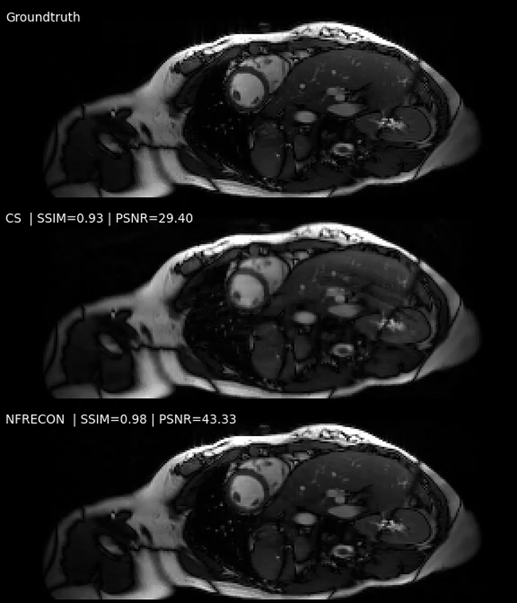

<div align="center">

# NFRECON

[](https://www.python.org/)
[](https://docs.astral.sh/uv/)
[](https://hydra.cc/)
[](https://black.readthedocs.io/en/stable/)
[](https://pytorch.org/)

</div>

<br/>

---

## Overview

**NFRECON** is a **model-based MRI reconstruction library** for continuous-domain imaging using
**neural field representations**.

The library supports static and dynamic 2D/3D MRI reconstruction from highly undersampled k-space
data by modeling both magnetization and coil sensitivities as **continuous functions of space and
time**. Neural fields are embedded within a physics-based parallel imaging forward model
and are optimized directly from measured data.

NFRECON is designed as **reconstruction infrastructure** with a focus on research reproducibility,
extensibility, and scan‑specific modeling.

---

## Reconstruction Example

Below we illustrate the reconstruction capabilities of NFRECON on a dynamic cardiac MRI
dataset (OCMR), using retrospective undersampling at acceleration factor 8.
See `examples/` and the associated paper for a broader range of applications
and experiments with more aggressive undersampling.

In this setting, we compare against a **strong compressed sensing (CS) baseline** combining:
- spatiotemporal total variation (TV),
- spatial wavelet sparsity, and
- low-rank regularization.

The corresponding regularization weights are **tuned via Bayesian optimization**,
providing a carefully optimized state-of-the-art reference rather than a heuristic baseline.

Despite this strong baseline, NFRECON produces reconstructions with sharper spatial detail,
improved temporal consistency (reduced flickering), and reduced undersampling artifacts.

<p align="center">
  <a href="https://raw.githubusercontent.com/RaySheombarsing/nfrecon/main/assets/ocmr_recon_example.mp4">
    
  </a>
</p>

<p align="center">
<em>Ground truth (top), CS (TV + Wavelet + LR) (middle), and NFRECON (bottom).</em>
</p>

---

## Core Ideas

- **Continuous-domain modeling**  Images and coil sensitivities are represented as differentiable
  functions rather than voxelized arrays.

- **Neural field parameterizations**  Implicit neural fields provide flexible, scan-specific
  function representations without requiring external training data.

- **Tensor-product structure**  Tensor products of univariate neural fields enable scalable
  evaluation, differentiation, and regularization in dynamic 2D and 3D MRI.

- **Model-based reconstruction**  Neural fields are embedded within a physics-based parallel imaging
  forward model and optimized directly from measured k-space data.

---

## Scope

- **Reconstruction modes:** Static and dynamic MRI
- **Spatial domains:** 2D and 3D
- **Joint optimization:** Magnetization and coil sensitivities
- **Acquisition types:** Highly undersampled k-space data
- **Framework**: Research-oriented infrastructure, not a pretrained end-to-end model

NFRECON focuses on **reconstruction methodology and infrastructure** rather than downstream analysis
or supervised, dataset-trained predictors.

---

## Installation

### Requirements

- Python ≥ 3.11.6
- [uv](https://docs.astral.sh/uv/getting-started/installation/)

### Clone & Install

```bash
git clone https://github.com/RaySheombarsing/nfrecon.git
cd nfrecon
uv sync
```

The project uses `uv` for dependency management, which automatically creates and manages a virtual
environment.

### PyTorch Installation

NFRECON depends on **PyTorch**, which must be installed separately due to
platform-specific builds (CPU, CUDA, Apple Metal, etc.).

For CPU-based usage, PyTorch can be installed together with NFRECON:

```bash
uv sync --extra torch
```

For GPU setups, install PyTorch manually from https://pytorch.org/.

---

## Quickstart

NFRECON reconstructions require model, data, and optimization configurations.
Configuration files are located in `nfrecon/configs/`. Fully configured
examples are provided in the `examples/` directory.

### Run an example

To run a complete dynamic MRI reconstruction using the OCMR example:

```bash
bash examples/dynamic/ocmr/run.sh
```

Before running, edit `run.sh` to set:
- `repo_dir` — path to your nfrecon installation
- `out_dir` — output directory
- `data_path` — path to your `.npz` k-space data

### Output

Reconstruction outputs:
- Model checkpoints
- Logs and configuration files for reproducibility

---

## Minimal Usage (CLI)

NFRECON uses Hydra-based configuration. A minimal reconstruction, e.g., for
the ocmr dataset, can be run as follows:

```bash
uv run nfrecon reconstruct \
    --config-dir ${config_dir} \
    setup.out_dir=${out_dir} \
    setup.use_mlflow=True \
    setup.device="cuda:0" \
    data=ocmr \
    samplers=ocmr \
    model=ocmr \
    loss=ocmr \
    optimizer=ocmr \
    hydra.sweep.dir=${out_dir}
```

See `examples/` for the full details. After training, a model checkpoint can
be used to evaluate the MRI signal and coil sensitivities, at any desired
resolution, using

```bash
uv run nfrecon evaluate \
 ${model_checkpoint_path} \
 ${output_dir} \
 --resolution nt nz ny nx \
 --compute_coil_maps \
 --device "cuda:0"
```

Run ```uv run nfrecon evaluate -h``` for a detailed description of all the options.

---

## Examples

NFRECON includes end-to-end reconstruction examples:

### Available Examples

- **`examples/dynamic/ocmr/`** — Dynamic 2D cardiac reconstruction with processing pipeline
- **`examples/dynamic/3d_mri_thigh/`** — Dynamic 3D lower-body reconstruction with processing pipeline
- **`examples/dynamic/3d_cmr/`** — Dynamic 3D cardiac reconstruction with processing pipeline

Each example directory contains:

- **`run.sh`** — Reconstruction command (adjust paths for your environment)
- **`configs/`** — Hydra configuration files for model, loss, optimizer, and sampling
- **`processing/`** — Dataset-specific scripts to convert raw k-space data into NFRECON format

---

## Data Format

NFRECON expects k-space data in **NumPy `.npz` format**. For **dynamic k-space data**, the `.npz`
file must contain the data specified below. The key names are configurable and must be specified
in the associated configuration file, see `nfrecon/configs/data/default.yaml`.

| Key | Shape | Description |
|-----|-------|-------------|
| `kspace_vals_<t>` | `(num_coils, npts)` | Complex k-space samples at time index `t` |
| `kspace_coords_<t>` | `(npts, spatial_dim)` | Cartesian coordinates in k-space at time index `t` |
| `fov` | `(spatial_dim,)` | Field of view (in physical units, e.g., meters) |
| `dt` | `scalar or (1,)` | Temporal resolution (seconds between time frames) |
| `gridsize` | `(spatial_dim,)` | Grid size per spatial dimension |

**Notes:**
- `npts` may vary across time indices.
- `spatial_dim` is 2 for 2D imaging or 3 for 3D imaging.

Each example includes **dataset-specific conversion scripts** in the `processing/` subdirectory.
**These scripts are *dataset-specific examples* and are not part of the NFRECON core library.** Use
them as templates: adapt preprocessing steps and naming conventions to match your acquisition
protocol and data format.

---

## Citation

If you use **NFRECON** in your research, please cite both the software
(repository) and the associated publication.

### Software

```bibtex
@software{sheombarsing2026nfrecon,
  author = {Sheombarsing, Ray},
  title = {NFRECON: MRI Reconstruction using Neural Field Expansions},
  year = {2026},
  url = {https://github.com/RaySheombarsing/nfrecon}
}
```

### Paper

```bibtex
@article{sheombarsing2026nfrecon,
  title={Model-based Dynamic 3D MRI Reconstruction using Neural Fields and Tensor Product Expansions},
  author={Sheombarsing, Ray and van Riel, Max and Heesterbeek, David and van den Berg, Nico and Sbrizzi, Alessandro},
  journal={arXiv},
  year={2026},
  doi={10.48550/arXiv.2605.08275}
}
```

**Paper:** https://doi.org/10.48550/arXiv.2605.08275

---

## License

See `LICENSE` file for details.
